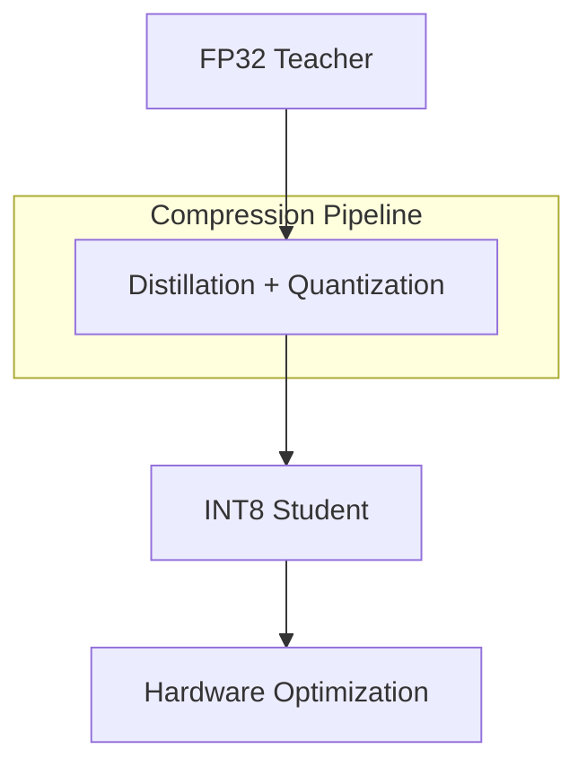

# Algorithmic Optimization: Quantization-Aware KD

Quantization-Aware Knowledge Distillation (QAKD) is a powerful technique that combines the benefits of model compression via distillation with bit-width reduction. While standard distillation reduces the number of parameters, quantization reduces the precision of those parameters (e.g., from 32-bit floating point to 8-bit or even 4-bit integers). QAKD integrates these two processes, allowing the student to learn how to represent the teacher's high-precision knowledge within a constrained, low-precision numerical space.

This approach is critical for achieving extreme compression ratios required for deployment on ultra-low-power edge devices and microcontrollers. By simulating the effects of quantization during the distillation training process, the model can compensate for the potential loss of accuracy that typically occurs when a model is quantized after training. The result is a highly efficient model that maintains high fidelity to the original teacher's performance while operating with a fraction of the memory and computational footprint.

[Back to README](../README.md)
