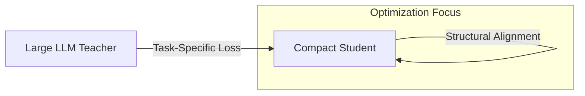

# Algorithmic Optimization: Task-Specific KD

Task-specific knowledge distillation focuses on tailoring the distillation process to the unique requirements of complex generative and sequence-based tasks. Unlike general-purpose distillation, which might target a simple classification objective, task-specific KD (e.g., DistilBERT) optimizes the student for particular downstream applications like natural language understanding, text generation, or image synthesis. This involves not only mimicking final outputs but also aligning internal structural components like attention heads and hidden states that are critical for that specific task.

In the realm of Large Language Models (LLMs) and diffusion models, task-specific KD has become essential for deploying state-of-the-art AI on consumer hardware. By focusing the student's learning capacity on the most relevant features of a task—such as the linguistic nuances in a translation task or the spatial relationships in Stable Diffusion—developers can create highly efficient models that retain the majority of the original model's creative and analytical capabilities while being significantly smaller and faster.

[Back to README](../README.md)
