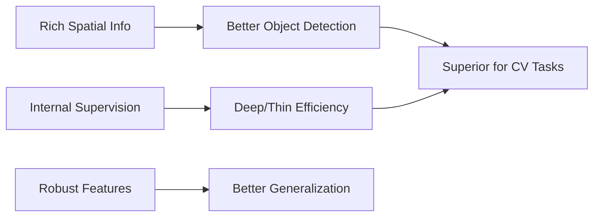

# Feature-Based Distillation: Core Benefit

The most significant benefit of feature-based distillation is its effectiveness in complex computer vision tasks like object detection, segmentation, and video analysis. In these tasks, the final output (logits) often lacks the rich spatial and structural information required to guide a student effectively. By distilling intermediate feature maps, the student can learn to identify objects, textures, and boundaries with the same precision as the teacher.

Additionally, feature-based methods allow for the training of much deeper and thinner models, which can be more parameter-efficient than their wider counterparts. By providing internal supervision, these methods mitigate the difficulty of training deep networks from scratch. This leads to models that not only perform well on the primary task but also possess more robust and transferable feature representations, making them ideal for multi-task learning or domain adaptation scenarios.

[Back to README](../README.md)
