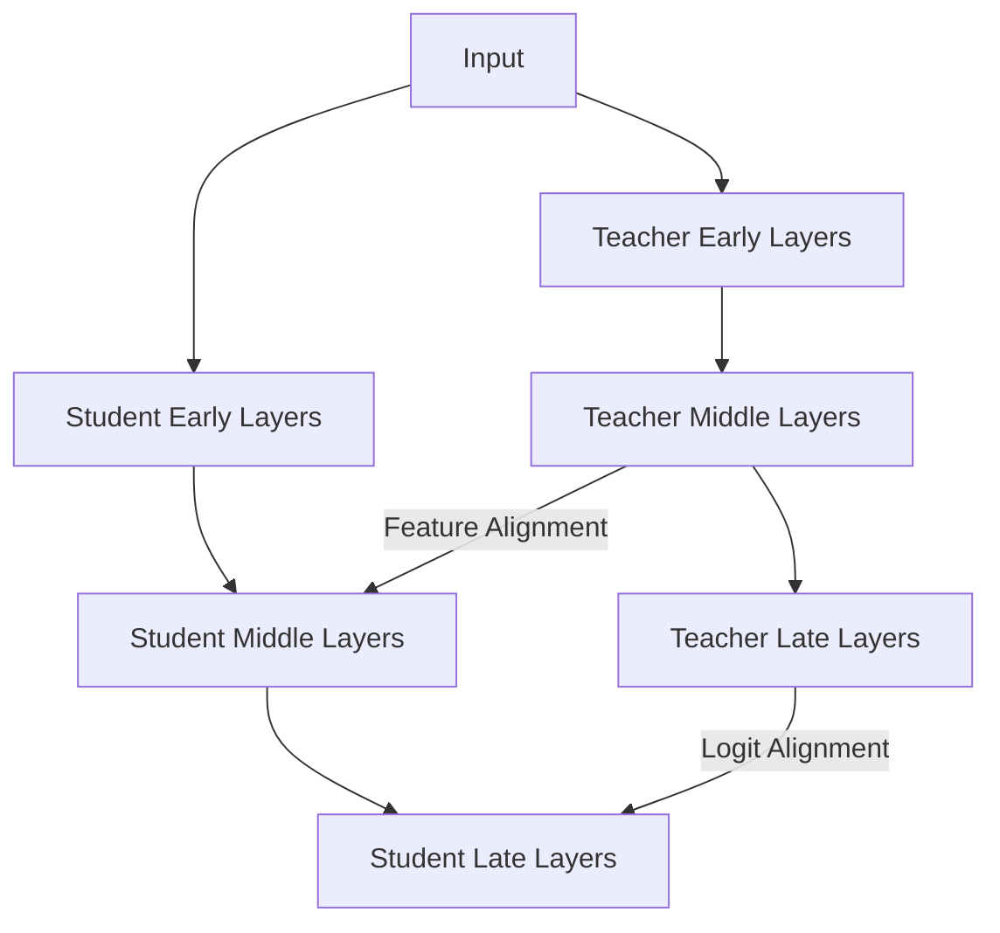

# Feature-Based Distillation: Definition

Feature-based knowledge distillation, introduced significantly by the FitNets paper in 2014, shifts the focus from the final output to the internal representations of the network. While response-based methods mimic "what" the teacher decides, feature-based methods attempt to mimic "how" the teacher thinks. This is achieved by aligning the intermediate feature maps or hidden layers of the student model with those of the teacher.

This approach is particularly powerful because it provides the student with more granular guidance throughout its depth. Instead of only receiving feedback at the end of the network, the student is supervised at multiple stages, learning to extract similar visual or semantic features as the teacher. This often results in a student that generalizes better and understands the underlying data structure more deeply than one trained solely on final outputs.

[Back to README](../README.md)
