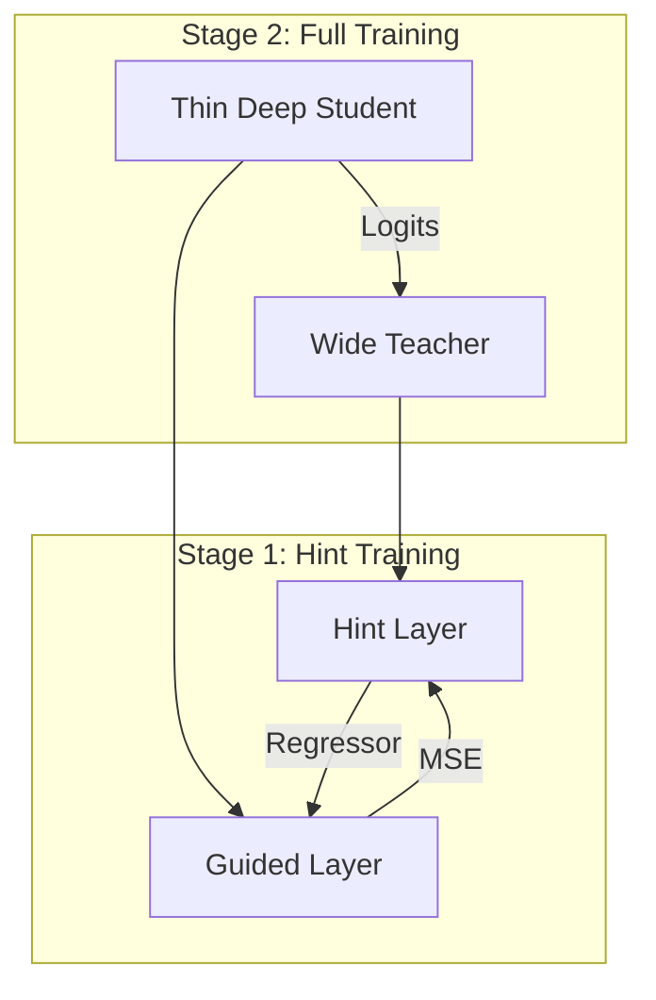

# FitNets: Hints for Thin Deep Nets

FitNets, proposed by Adriana Romero et al. in 2014, represented a major milestone in knowledge distillation by introducing the concept of "hints." The core idea was to train "Thin Deep" student models that are narrower than the teacher but potentially deeper. To facilitate the training of these deep students, FitNets use intermediate layers of the teacher as hints to guide the training of the student's corresponding middle layers.

The FitNets training process often involves a two-stage approach. First, the student's early layers are trained to mimic the teacher's hint layer using a regressor to bridge any dimensionality gaps. Once this initial alignment is established, the entire student network is trained using both the standard ground-truth labels and the teacher's softened logits. This hierarchical supervision allows for the successful training of very deep students that would otherwise suffer from optimization challenges like vanishing gradients.

[Back to README](../README.md)
