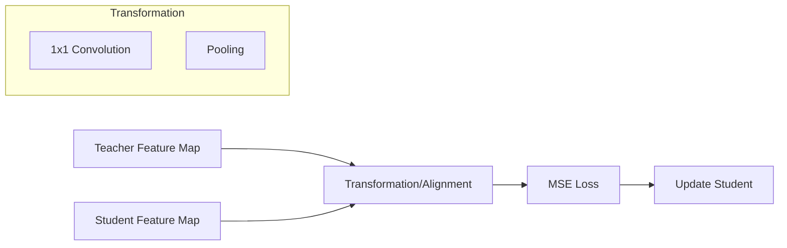

# Feature-Based Distillation: Mechanism

The mechanism of feature-based distillation involves selecting specific "hint" layers from the teacher and "guided" layers from the student. Since students are typically smaller and have different layer dimensions than their teachers, transformation functions (such as 1x1 convolutions or fully connected layers) are often used to align the shapes of the feature maps. The distillation objective then minimizes the distance—usually through Mean Squared Error (MSE)—between these aligned representations.

By matching intermediate feature maps, the student learns to replicate the teacher's internal activation patterns. This process helps the student capture spatial hierarchies and complex semantic information that might be lost if only final logits were considered. Modern variations may also use attention-based alignment, where the student mimics the teacher's attention maps, focusing on the same regions of the input data that the teacher deems important for the task.

[Back to README](../README.md)
