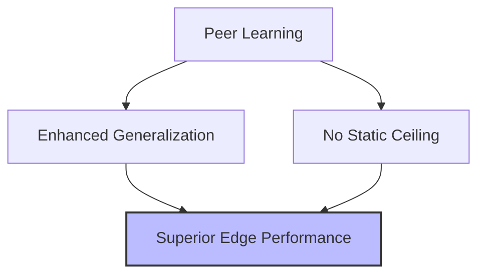

# Online & Co-Distillation: Core Benefit

The primary benefit of online co-distillation is its ability to prevent the "performance ceiling" often encountered in traditional teacher-student setups. In a static distillation process, the student is fundamentally limited by the teacher's expertise; it can rarely exceed the accuracy of the model it is mimicking. However, in a co-distillation environment, the dynamic interaction between peers allows the entire ensemble to collectively discover better local minima that a single static model might have missed.

Furthermore, this method enhances the generalization capabilities of the models involved. By constantly being exposed to different "perspectives" on the data from its peers, each model learns to ignore noise and focus on more robust features. This leads to models that are not only more accurate but also more resilient to over-fitting. The resulting networks often achieve a level of performance that is surprisingly close to or even better than larger models trained using standard supervised methods.

[Back to README](../README.md)
