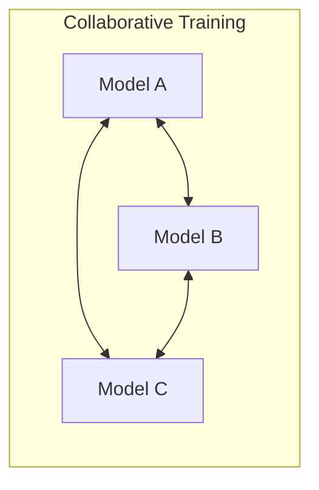

# Online & Co-Distillation: Definition

Online knowledge distillation, often referred to as Co-Distillation or Deep Mutual Learning (DML), represents a paradigm shift from traditional teacher-student models. In the conventional approach, a pre-trained, static teacher model transfers its knowledge to a smaller student model in a one-way process. In contrast, online distillation involves the simultaneous training of multiple models (peers) that learn from each other throughout the training process.

This collaborative learning framework allows models to exchange information dynamically. Instead of a hierarchy where one model is superior, peer networks of similar or different architectures work together, with each network acting as both a teacher and a student. This mutual learning process helps each network generalize better by observing the probability distributions of its peers, leading to higher performance than if they were trained in isolation.

[Back to README](../README.md)
