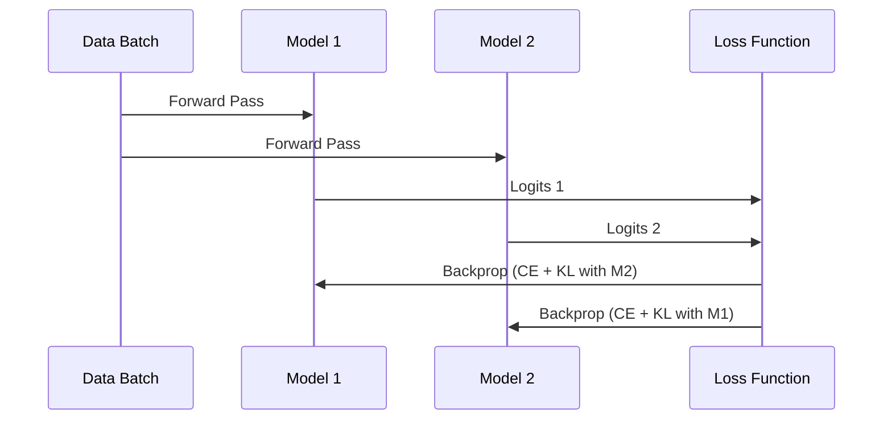

# Online & Co-Distillation: Mechanism

The core mechanism of online co-distillation lies in the integration of a mutual learning loss into the standard supervised learning objective. For each model in the ensemble, the loss function consists of two primary components: a standard cross-entropy loss with the ground truth labels and a Kullback-Leibler (KL) Divergence loss that measures the difference between its own output probabilities and those of its peers. This ensures that every model not only tries to predict the correct label but also aligns its class probability distributions with the collective "wisdom" of the group.

During each training iteration, all models process the same mini-batch of data. After the forward pass, each model's predictions are used as "soft targets" for the other models. Gradients are then computed and backpropagated, allowing every network to update its weights based on both the hard labels and the soft predictions from its partners. This iterative exchange happens in real-time, enabling the models to converge towards a more robust representation of the data.

[Back to README](../README.md)
