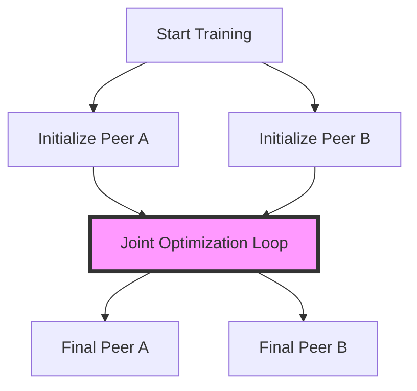

# Online & Co-Distillation: No Pre-training

One of the most significant advantages of online co-distillation is that it completely eliminates the need for a separate, computationally expensive pre-training phase for a large teacher model. In traditional distillation, one must first invest significant time and hardware resources into training a massive "sovereign" model to convergence before the distillation process can even begin. Online distillation bypasses this sequential dependency by starting all models from scratch simultaneously.

By removing the pre-training bottleneck, researchers and engineers can achieve high-performing models in a single training run. This "from-scratch" approach is particularly beneficial in scenarios where data is evolving or when computational resources are limited, as it streamlines the model development pipeline. The synergy between peer models often compensates for the lack of a highly accurate pre-trained teacher, as the ensemble's collective learning often exceeds the performance of any single model trained independently.

[Back to README](../README.md)
