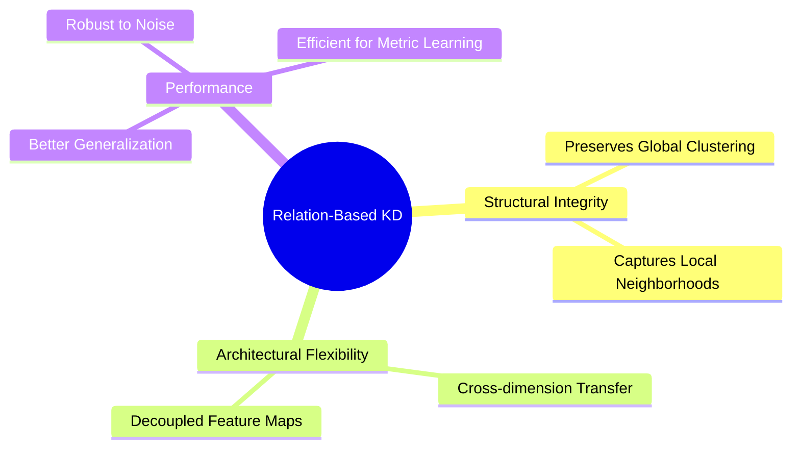

# Core Benefits of Relation-Based KD

The primary benefit of relation-based knowledge distillation is its ability to transfer "structural knowledge" that is often lost in point-wise or feature-based methods. While traditional KD focuses on making the student's output for a single image match the teacher's, relation-based KD ensures the student understands how that image relates to others. This holistic view leads to superior performance in tasks requiring a deep understanding of class hierarchies and feature similarities, such as metric learning and zero-shot classification.

Another significant advantage is its flexibility regarding architecture. Since the distillation objective is based on relations (which are often dimensionless or normalized), the student and teacher do not need to share the same feature dimensions or even the same internal structure. This decoupling allows for much smaller student models to effectively learn from extremely large teachers. Furthermore, by regularizing the student's representation space based on the teacher's manifold, it often leads to faster convergence and better generalization on unseen datasets.

[Back to README](../README.md)
