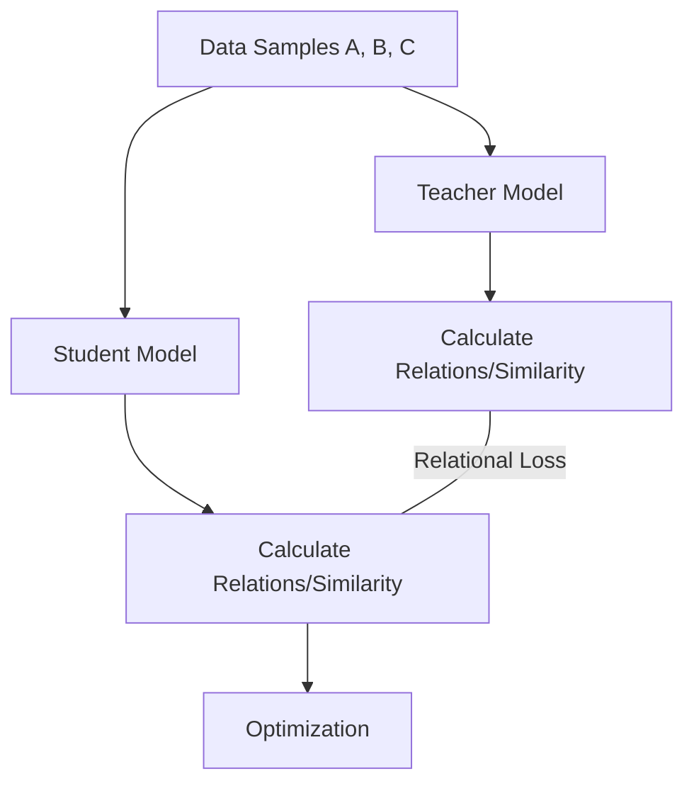

# Relation-Based Knowledge Distillation: Definition

Relation-based knowledge distillation (KD) represents a paradigm shift in knowledge transfer, moving beyond the traditional approach of mimicking individual feature maps or output logits. Introduced prominently around 2019, this method focuses on capturing the structural relations between different data samples or across different layers of the neural network. Instead of asking the student to "see" exactly what the teacher sees at a specific point, relation-based KD asks the student to understand how different concepts or inputs relate to one another in the teacher's representation space.

This approach is rooted in the belief that the true "knowledge" of a teacher model lies in its ability to cluster similar samples together and push dissimilar ones apart. By transferring these relational structures—often represented as similarity matrices, feature correlations, or graphs—the student model can inherit the teacher's semantic understanding of the data manifold. This is particularly useful when the student and teacher have significantly different architectures, as it focuses on the underlying logic rather than the specific numerical values of the activations.

[Back to README](../README.md)
