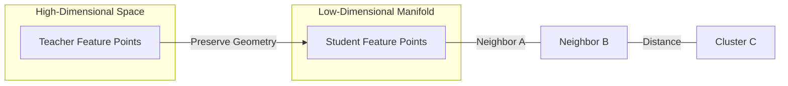

# Manifold Learning in Relation-Based KD

Relation-based knowledge distillation is intrinsically linked to manifold learning, which aims to uncover the low-dimensional structure embedded within high-dimensional data. In the context of KD, the teacher model has already learned a sophisticated manifold where semantically similar items are grouped together. Manifold-based distillation ensures that the student model preserves this geometric structure. By focusing on the "geometry" of the feature space, the student can maintain the local neighborhood relationships and the global clustering patterns that the teacher has identified as important.

Preserving the manifold geometry is crucial for tasks like image retrieval, face recognition, and clustering, where the relative distances between points are more important than the absolute coordinates. Techniques like multi-dimensional scaling or Laplacian eigenmaps are sometimes used to formalize these relational constraints. The result is a student model that generalizes better because it has learned the fundamental "shape" of the data, making it more robust to outliers and variations that don't conform to the learned manifold.

[Back to README](../README.md)
