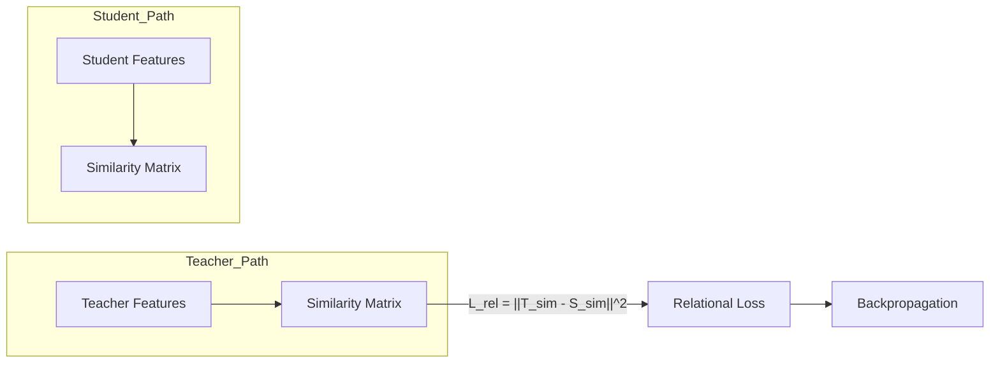

# Relation-Based Knowledge Distillation: Mechanism

The mechanism of relation-based knowledge distillation typically involves the construction of a representation that captures the interactions between data points within a mini-batch. The most common technique is the use of a Gram matrix or a similarity matrix, where each entry $(i, j)$ represents the similarity (often computed via cosine similarity or Euclidean distance) between the features of sample $i$ and sample $j$. The teacher model generates this relational map from its high-dimensional feature space, which then serves as a structural target for the student model.

Beyond simple sample-to-sample relations, advanced mechanisms may involve graph-based representations where samples are nodes and their relations are edges. The student is trained to minimize the divergence between its own generated graph and that of the teacher. This often involves specialized loss functions such as the Mean Squared Error (MSE) between similarity matrices or more complex metrics like the Kullback-Leibler (KL) divergence between probability distributions of relationships. By aligning these structures, the student learns to mimic the teacher's global perspective of the data distribution.

[Back to README](../README.md)
