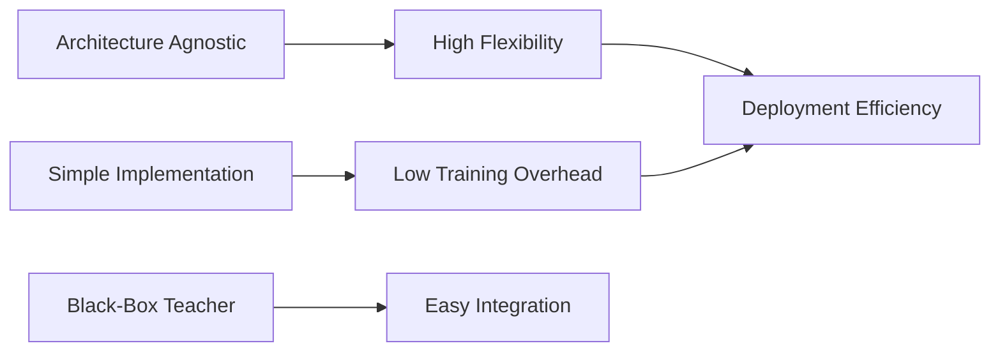

# Response-Based Distillation: Core Benefit

The primary benefit of response-based distillation lies in its extreme computational simplicity and architectural flexibility. Because this method only requires access to the final output layer (the logits) of the teacher model, it can be implemented without any knowledge of the teacher's internal structure. This "black-box" compatibility makes it easy to apply even when the teacher and student have vastly different architectures, such as distilling a ResNet teacher into a MobileNet student.

Furthermore, response-based distillation adds minimal overhead to the training pipeline. Developers do not need to perform complex feature mapping or dimensionality alignment between intermediate layers. It provides a straightforward way to achieve significant model compression and speedup for edge deployment while maintaining a high percentage of the teacher's original accuracy, making it the de facto starting point for many distillation projects.

[Back to README](../README.md)
