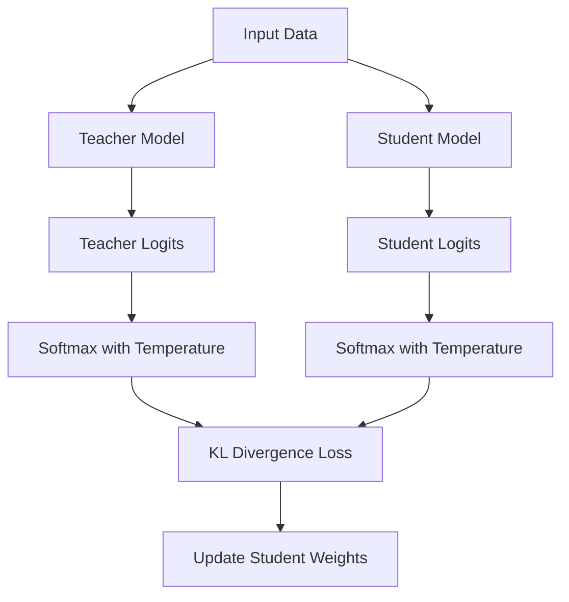

# Response-Based Distillation: Definition

Response-based knowledge distillation is the foundational approach to model compression, popularized by Geoffrey Hinton et al. in 2015. It focuses on transferring the final decision-making logic of a large teacher model to a smaller student model. Instead of just learning from hard labels (like "Cat" or "Dog"), the student learns from the teacher's full probability distribution across all classes.

This method assumes that the relative probabilities assigned by the teacher to incorrect classes contain valuable "dark knowledge" about the relationships between categories. For example, if a teacher model predicts an image is a "Labrador" but also gives a high secondary probability to "Golden Retriever," this tells the student that these two classes are visually similar, providing more structural information than a simple ground-truth label would.

[Back to README](../README.md)
