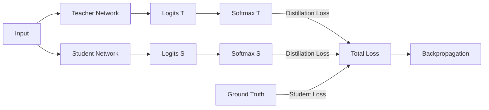

# Response-Based Distillation: Mechanism

The core mechanism of response-based distillation involves the comparison of the final output layers, specifically the logits, between the teacher and student networks. During training, the same input data is passed through both models. The teacher model, which is already pre-trained and fixed, generates a set of output scores (logits) for each class.

The student model generates its own logits, and the training objective is modified to include a distillation loss alongside the standard cross-entropy loss with ground-truth labels. This distillation loss typically uses Kullback-Leibler (KL) divergence to minimize the difference between the teacher's softened output distribution and the student's softened output distribution. By mimicking the teacher's confidence scores, the student inherits the nuanced classification boundaries of the larger model.

[Back to README](../README.md)
