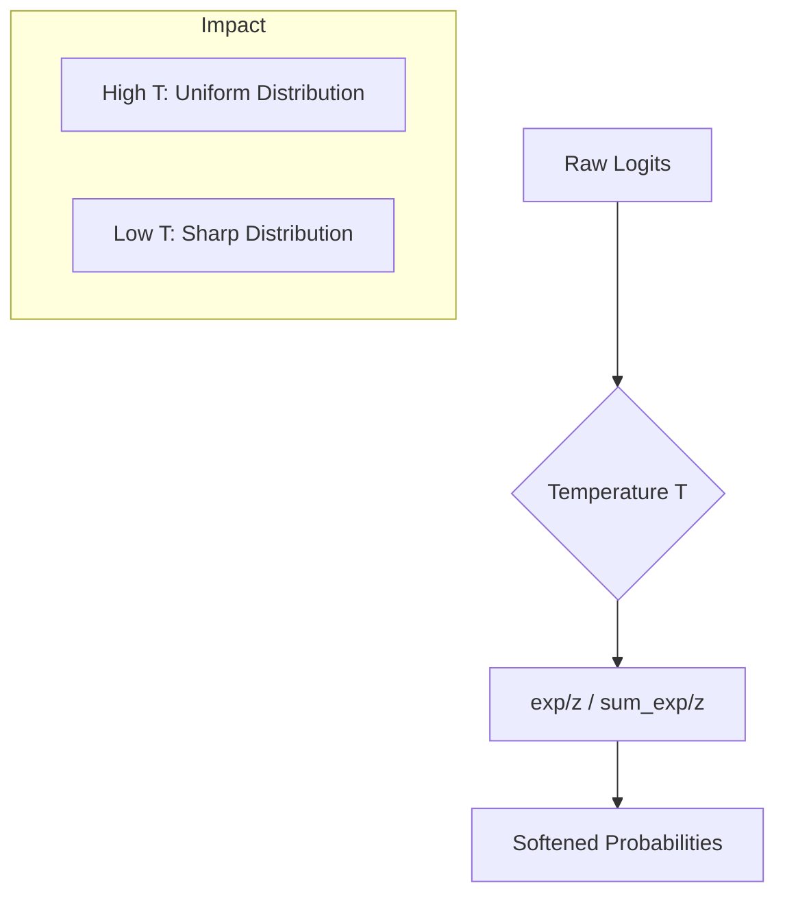

# Response-Based Distillation: Soft Targets and Temperature

Soft targets are the probability distributions produced by a teacher model after applying a temperature-scaled softmax function. In traditional classification, a softmax function often produces a "sharp" distribution where the winning class has a probability near 1.0 and others are near zero. This masks the "dark knowledge" or the subtle relationships between non-target classes that the teacher has learned.

To reveal this hidden structure, a "Temperature" parameter (T) is introduced into the softmax function. By increasing T, the resulting probability distribution becomes smoother or "softer." This allows the student model to see exactly which incorrect classes the teacher finds most similar to the correct one. During inference, the temperature is typically set back to 1.0, ensuring the student maintains its intended predictive behavior while benefiting from the enriched training signals.

[Back to README](../README.md)
