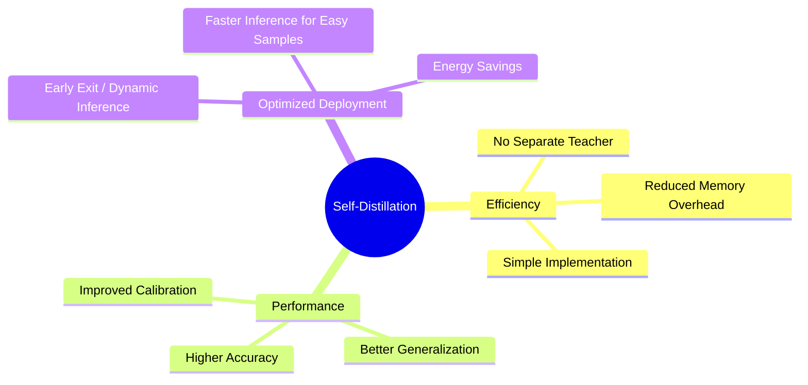

# Core Benefits of Self-Distillation

The primary benefit of self-distillation is its remarkable efficiency and simplicity. It allows for performance gains without the need to find, train, or store a massive teacher model. This makes it ideal for resource-constrained environments where the overhead of maintaining two separate models during training is prohibitive. By simply modifying the loss function or the training schedule, practitioners can unlock latent performance within their existing architectures, making it a "free" upgrade in many scenarios.

Beyond accuracy improvements, self-distillation significantly improves model calibration. Modern deep networks are often overconfident in their predictions; self-distillation helps by providing more realistic probability estimates. Additionally, when using early-exit mechanisms, self-distillation enables "dynamic inference," where the model can skip later layers for "easy" samples, leading to substantial energy and time savings during deployment. These benefits combine to make self-distillation a versatile tool for both boosting performance and optimizing efficiency.

[Back to README](../README.md)
