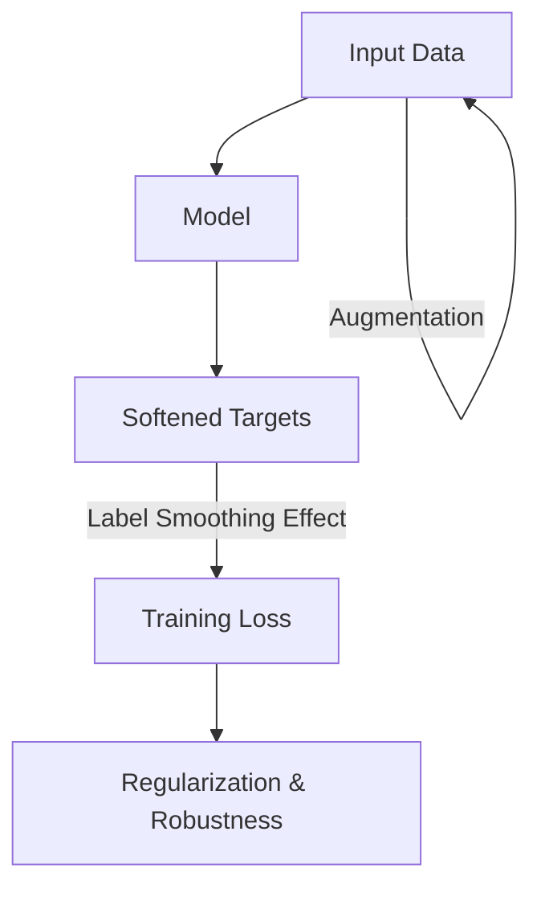

# Data Augmentation Effect in Self-Distillation

Self-distillation exhibits a powerful regularizing effect that is mathematically similar to data augmentation. When a model distills its own predictions, it is essentially being trained on "softened" versions of the labels. These soft targets contain information about the inter-class similarities (e.g., an image of a dog having a 10% probability of being a cat). This extra information acts as a form of label smoothing, preventing the model from becoming overly confident and helping it learn more flexible decision boundaries.

Furthermore, because the model's own predictions vary slightly between epochs or with different input transformations, self-distillation can be viewed as an implicit form of data augmentation. It forces the model to be invariant to these small internal fluctuations. This effect is particularly pronounced in "Born-Again" training, where each successive generation of the model becomes more robust. The result is a significant improvement in accuracy and a reduction in overfitting, achieving gains that are often comparable to using much more complex, manually-engineered data augmentation pipelines.

[Back to README](../README.md)
