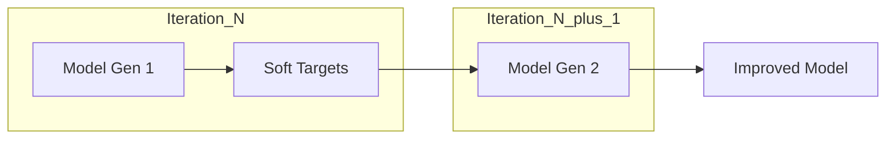

# Self-Distillation: Definition

Self-distillation is a specialized branch of knowledge distillation where a model acts as its own teacher. Unlike traditional KD, which requires a pre-trained, larger teacher model (like a ResNet-101 teaching a ResNet-18), self-distillation focuses on extracting and refining knowledge within a single architectural framework. This concept gained significant traction with the "Born-Again Neural Networks" (2018), where a model is trained to match the output distributions of an identical version of itself from a previous generation or a deeper part of itself.

The core idea is that even without an external expert, a model can progressively improve its internal representations by distilling its own "dark knowledge." This is often achieved by using the predictions from earlier iterations (epochs) or from deeper layers to supervise the training of earlier layers. By treating its own high-level abstractions as ground truth for its lower-level components, the model achieves a form of iterative refinement that leads to higher accuracy and better calibrated confidence scores.

[Back to README](../README.md)
