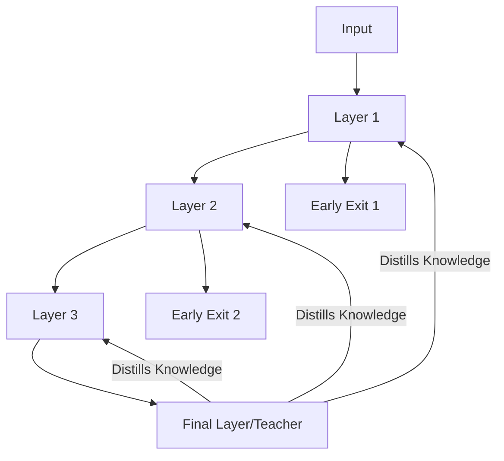

# Self-Distillation: Mechanism

The mechanism of self-distillation often involves the "Early Exit" or "Deep-to-Shallow" strategy. In this setup, additional classifiers (auxiliary heads) are attached to the intermediate layers of a deep neural network. During training, the deepest layers (which are presumably more accurate) provide soft targets or feature representations that the shallower layers are forced to mimic. This effectively distills the complex reasoning of the entire network into its early stages, allowing for faster inference and better overall performance.

Another common mechanism is "Temporal Distillation," where the model from the current epoch is regularized by the predictions it made in the previous epoch. This acts as a form of consistency regularization, ensuring that the model's decision boundaries evolve smoothly and don't overfit to transient noise in the training data. By enforcing this internal consistency across layers or time, self-distillation creates a self-correcting feedback loop that pushes the model toward more robust and generalizable features without the overhead of a separate teacher model.

[Back to README](../README.md)
